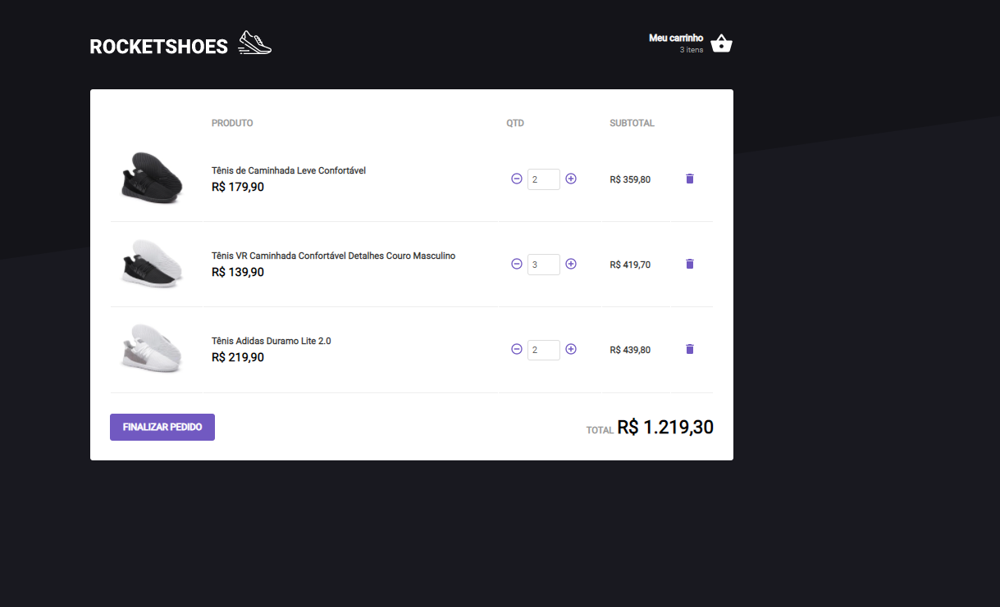

**E-commerce RocketShoes**
- Criação de um e-commerce durante o desafio do Ignite.

**Rodar o projeto**

Ao clonar o projeto abra o terminal e execute os seguintes comandos:

`npm install`

`npm run start`

**Rodar os testes**

Abra o terminal e execute o comando

`npm run test`

Rodar o JSON Server

`npm run server`

**O que foi utilizado no desenvolvimento deste projeto?**

- React.js
- Typescript
- Styled Components
- Context API
- Hooks
 
## Showcase

##### Lista de Produtos

##### Carinho de Compras

